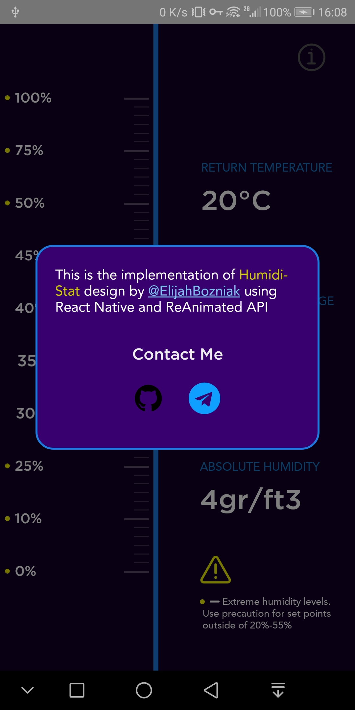

# HumidiStat Demo App

This is an animation demonstration of a beautiful design by [@ElijahBozniak](https://dribbble.com/shots/6315218-IoT-Humidity-App-Slider). Actually, it's implemented partially because of time limitation and some library bugs (which prevented me from making it as real as possible).

## [Download The APK](__assets__/app.apk?raw=true)

### What about IOS?

I have to say that there is no IOS version, simply because i don't have a IOS development setup. Blame Apple for that :unamused:

## Screenshots

 
 
 

 

## Made Possible With:  
+ [React Native](https://facebook.github.io/react-native/)
+  [React Native Reanimated](https://facebook.github.io/react-native/)
+  [React Native Gesture Handler](https://kmagiera.github.io/react-native-gesture-handler)
+  [React Native Popup Dialog](https://github.com/jacklam718/react-native-popup-dialog)
+  [React Native SVG](https://github.com/react-native-community/react-native-svg)
+  [d3-scale](https://github.com/d3/d3-scale)
+  [d3-path](https://github.com/d3/d3-path)

